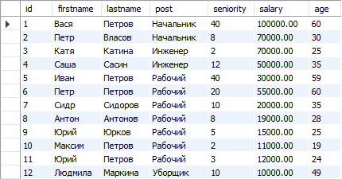
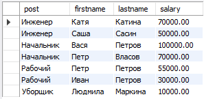

# Урок 3

## SQL – выборка данных, сортировка, агрегатные функции

---

## Отсортируйте данные по полю заработная плата (salary) в порядке: убывания; возрастания

**По убыванию**

**По возрастанию**

---

## Выведите 5 максимальных заработных плат (salary)

---

## Посчитайте суммарную зарплату (salary) по каждой специальности (роst)

---

## Найдите кол-во сотрудников с специальностью (post) «Рабочий» в возрасте от 24 до 49 лет включительно

---

## Найдите количество специальностей

---

## Выведите специальности, у которых средний возраст сотрудников меньше 30 лет

---

## ** Дополнительно

## Внутри каждой должности вывести ТОП-2 по ЗП (2 самых высокооплачиваемых сотрудника по ЗП внутри каждой должности)

---

## Дополнительно по базе данных для ВК(in progress)

## -- Посчитать количество документов у каждого пользователя (doc, docx, html)

---

## -- Посчитать лайки для моих документов (моих медиа)

---

[В начало](#урок-3)
